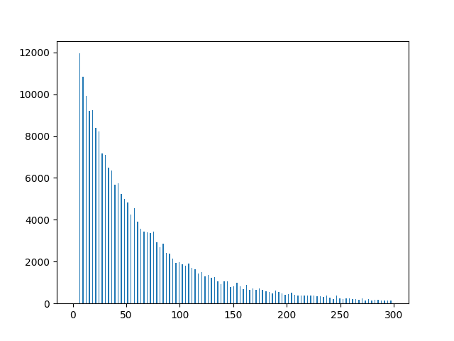
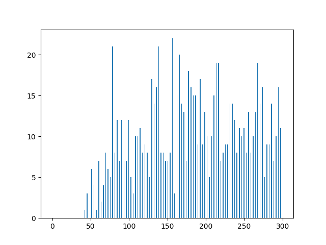

# 🧬 ORF Extraction and Validation Pipeline

## 📘 Project Title
**Open Reading Frame (ORF) Detection in a Partial Human Transcriptome Assembly**

## 🎯 Objective
This project aims to extract Open Reading Frames (ORFs) from a partial human transcriptome (`Homo_sapiens_cdna_assembled.fasta`) and validate them using the BLAST+ tool against the UniProt/SwissProt protein database. The workflow supports exporting results in GFF and FASTA formats and analyzing coding potential through BLAST-based validation.

---

## 🧪 Features

- ORF extraction from transcript sequences
- Sequence and annotation export in GFF and FASTA formats
- BLASTx validation against UniProt/SwissProt
- Detection of coding regions (CDS) and UTRs
- False positive rate assessment
- ORF length distribution plotting
- Containerized execution using Docker

---

## 🛠️ Project Structure

### 🔹 `ORFExtractor` (Main Pipeline Class)
Handles the extraction, export, BLAST validation, and assessment of ORFs.

| Method        | Description |
|---------------|-------------|
| `extract()`   | Parses input FASTA and extracts valid ORFs |
| `entry_export(orf)` | Exports individual ORF as GFF and FASTA entry |
| `blastx()`    | Runs BLASTx on extracted ORFs |
| `orf_validate()` | Validates ORFs based on BLAST hits |
| `orf_assessment()` | Summarizes results and generates plots |

---

### 🔹 `ORF`
Encapsulates individual ORF metadata and functionality.

| Key Attributes | Description |
|----------------|-------------|
| `seq`, `seq_id`, `start_pos`, `end_pos` | ORF sequence and location |
| `frame`, `src`, `score`, `id`, `attributes` | Descriptive metadata |

| Key Methods | Purpose |
|-------------|---------|
| `to_gff_tuple()` | GFF-compatible output |
| `to_fasta_tuple()` | FASTA-compatible output |
| `to_CDS()` | Converts ORF object into CDS format |
| `add_nested_orf()` | Supports UTR and nested feature handling |

---

### 🔹 `GffFile`
Creates and manages `.gff` annotation files.

| Functionality | Description |
|---------------|-------------|
| `set_header()` | Adds GFF metadata header |
| `add_entry()`  | Appends features to GFF |
| `write_orf_file()` | Writes ORF entries in bulk |
| `parse()` | Parses existing GFF files |

---

### 🔹 `FastaFile`
Writes ORF sequences into FASTA format.

| Method | Description |
|--------|-------------|
| `add_entry()` | Adds a sequence entry |
| `write_orf_file()` | Writes all ORFs to FASTA |

---

### 🔹 `BlastTsvFile`
Handles parsing and top-hit extraction from BLASTx output in TSV format (outfmt 7).

| Method | Description |
|--------|-------------|
| `parse()` | Yields structured BLAST hits |
| `top_hit_extract()` | Extracts best hit per ORF (based on e-value) |

---

## 🐳 Docker Setup

### 🔧 Build Instructions

1. Build [docker image](dockerfiles/blast/v2.16.0/dockerfile) provided
```bash
docker build -t orf-blast:v2.16.0
```

2. Run interactive container

```bash
docker run -it --rm -v /path/to/project:/analysis orf-blast:v2.16.0 bash
```

3. Run scrip in your container

```docker
cd /analysis
python main.py
```

## 📊 Results

After running the ORF extraction and validation pipeline on the `Homo_sapiens_cdna_assembled.fasta` transcriptome file, the following results were obtained:

- **Total input sequences**: 5,497
- **Total ORFs extracted**: 221,920
- **Sequences without any ORF**: 17
- **Average ORFs per sequence**: ~40.37
- **Validated ORFs (CDS hits via BLAST)**: 4,041
- **False positive rate**: 98.18%

### 🔬 ORF Length Statistics

- **Longest ORFs**:
  - `ORF_72385`: 21,246 bp
  - `ORF_11146`: 16,965 bp
  - `ORF_10642`: 16,218 bp
  - `ORF_11278`: 15,393 bp
  - `ORF_147638`: 13,767 bp
  - `ORF_147242`: 13,740 bp

### Estimating the Mean Length of Open Reading Frames (ORFs) Using a Geometric Distribution
The human genome code comprise 64 codon from which 3 are stop codons.
If we consider that each codon is equally likely in a sequence, the probability to get a stop codon is 3/64 = 0.46875.
Then the expected length of an ORF for randomly generated sequence is 1/ 0.46875 =~ 21.3.
The average length of non matching ORF should be around 21 codons or 63 bp.


1. The ORF length distribution for the entire set 
 Skewed toward shorter ORFs, with a large number of ORFs under 50 bp.


1. The ORF length distribution for the false positive ORFs


1. The ORF length distribution for true positive ORFs (CDS) tend to be longer, 
with distributions skewed to the right, reflecting the expected lengths of real coding sequences.




## 💬 Discussion

The pipeline successfully identified and annotated over 220,000 ORFs, but the very high false positive rate (98.18%) reveals a core challenge: distinguishing biologically meaningful coding regions from background noise.

### 🔍 Limitations

- **Naive ORF detection**: The current method detects ORFs based solely on start/stop codons
- **No filtering or minimum length threshold**: Many short ORFs (likely spurious) inflate the false positive count., without accounting for context (e.g., GC content, coding potential...).
- **BLAST-based validation limitations**:
  - Time and resource-intensive.
  - Bias toward well-characterized proteins.
  - Strict taxonomic filter (human-only, `taxid 9606`) may exclude valid homologs from related organisms.
  - can be challenging for new species or if they are poorly represented in protein databases.
  - 
### 🚀 Possible Improvements

- **Length thresholding**: Discard ORFs below a certain length (e.g., 63 codons) to reduce noise.
- **Functional classification**: Use GO annotation or protein family mapping to characterize validated ORFs.
- **UTR position validation**: The UTR position were based on the pimarily assessed ORF location but further validation with Blast hits are required to fully validate their location.

---

These results highlight the importance of post-processing and validation in ORF prediction pipelines. While raw ORF detection is straightforward, biological relevance must be rigorously assessed to ensure meaningful results.


## 👩‍🔬 Author

**Grégoire Descamps**  
Université Catholique de Lille  
Master 2 — Data Mining in Biosciences  
Academic Year: 2024–2025


## 📄 License

This project is released for academic and educational use only.